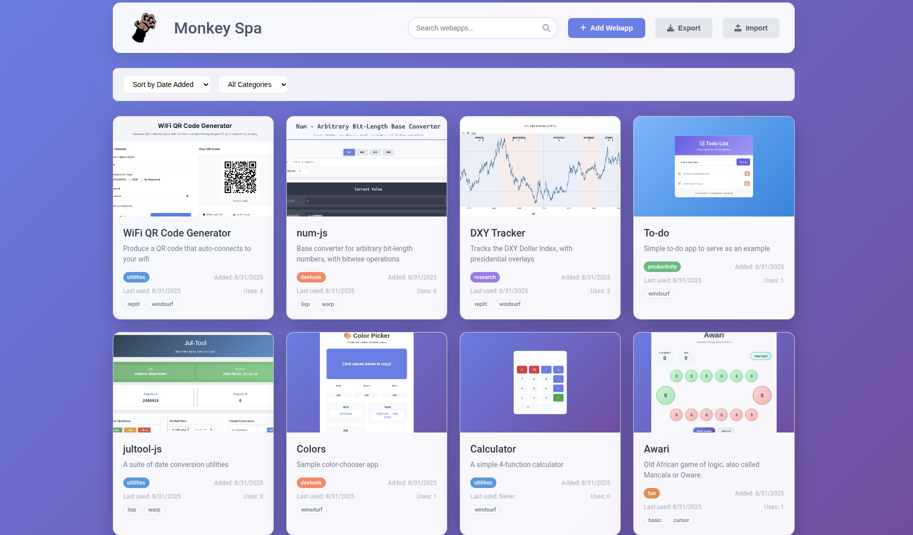

# Monkey Spa - Webapp Manager

)

Monkey Spa manages your collection of single-page HTML webapps. The grid interface tracks metadata, enables search, generates screenshots, and launches apps in new windows.

## Features

- **Grid View**: Card-based layout shows webapp previews
- **Automatic Screenshots**: html2canvas captures previews of your webapps
- **Manual Screenshot Upload**: Upload custom screenshots at higher resolution than html2canvas generates
- **Metadata**: Track name, description, category, tags, usage statistics, and dates
- **Search & Filter**: Find webapps by name, description, or tags with category filtering
- **CRUD Operations**: Add, edit, and delete webapps through modals
- **Import/Export**: Backup and share webapp collections in JSON or XML format
- **Usage Tracking**: Monitor when webapps were last used and usage frequency
- **IndexedDB Storage**: IndexedDB persists all data locally, storing 500+ webapps with full metadata. LocalStorage caps out around 5MB; IndexedDB handles 50-80MB depending on the browser.
- **Responsive Design**: Works on desktop, tablet, and mobile devices
- **UI**: Gradients, animations, and clean styling

## Getting Started

1. Open `monkey-spa.html` in your web browser
2. Click "Add Webapp" to add your first single-page HTML application. Samples included.
3. Fill in the details and upload your HTML file
4. Your webapp will appear in the grid with a preview card
5. Click on any webapp card to launch it in a new window

## Usage

### Adding Webapps
- Click the "Add Webapp" button
- Enter a name and description
- Select a category (Dev Tools, Research, Productivity, Utilities, Fun, Other)
- Add comma-separated tags to organize webapps
- Upload your HTML file
- Optionally upload a custom screenshot (otherwise one will be auto-generated)
- Click "Save Webapp"

### Managing Webapps
- **Launch**: Click on a webapp card to open it
- **Edit**: Hover over a card and click the edit icon
- **Delete**: Hover over a card and click the delete icon

### Search & Organization
- Use the search bar to find webapps by name, description, or tags
- Filter by category using the dropdown
- Sort by date added, name, or last used

### Import & Export
- **Export**: Click "Export" to download your webapp collection
  - Choose JSON or XML format
  - Includes all webapp data, screenshots, and metadata
  - Automatic filename generation with timestamps
- **Import**: Click "Import" to restore or merge webapp collections
  - Support for both JSON and XML files
  - Choose "Merge" to add new webapps or "Replace" to overwrite all
  - Duplicate prevention by webapp ID

Since all apps serialize into one file, transfer your entire collection by moving that single file to another system.

## Sample Webapps

The `samples/` directory contains nine example webapps: a calculator, color picker, Minesweeper, Pomodoro timer, password generator, slide puzzle, todo app, API tester, and IP geolocator. Each app runs standalone with no external dependencies beyond standard web APIs.

### Sample Apps Overview

| # | App Name | Description |
|---|----------|-------------|
| 1 | [Calculator](samples/README.md#1-calculator) | Scientific calculator with keyboard support |
| 2 | [Color Picker](samples/README.md#2-color-picker) | RGB/HEX/HSL color generator with presets |
| 3 | [Minesweeper](samples/README.md#3-minesweeper) | Classic game with difficulty levels and timer |
| 4 | [Pomodoro Timer](samples/README.md#4-pomodoro-timer) | Productivity tool with work/break cycles |
| 5 | [Quantum Pass](samples/README.md#5-quantum-pass) | Password generator with strength meter |
| 6 | [Slide Puzzle](samples/README.md#6-slide-puzzle) | 15-puzzle game with animations |
| 7 | [Todo App](samples/README.md#7-todo-app) | Task manager with localStorage |
| 8 | [API Tester](samples/README.md#8-api-tester) | HTTP request tool with multiple methods |
| 9 | [IP Geo Lookup](samples/README.md#9-ip-geo-lookup) | Location finder with interactive map |

### Detailed Documentation

The **[samples/README.md](samples/README.md)** file documents each sample's features and technology stack.

### Adding Sample Webapps

You can add any of these sample webapps to test the manager functionality:

1. Open `monkey-spa.html` in your browser
2. Click "Add Webapp"
3. Fill in the details (name, description, category)
4. Upload the HTML file from the `samples/` directory
5. Click "Save Webapp"

Each sample app uses different frontend technologies:
- Vanilla JavaScript with modern ES6+ features
- CSS Grid and Flexbox layouts
- LocalStorage and IndexedDB for data persistence
- Web Audio API for notifications
- Fetch API for HTTP requests
- Canvas and DOM manipulation for games
- Third-party libraries (Leaflet.js for mapping)

## Technical Details

### Data Storage
- The app stores all webapp metadata in browser IndexedDB
- The app stores HTML file contents as text within the webapp data
- No server required - everything runs client-side

### Browser Compatibility
- Modern browsers with ES6+ support
- IndexedDB support required
- File API support for HTML file uploads

## Customization

Customize the system by editing the source files:

- **Styling**: Change colors, layouts, or animations in `styles.css`
- **Categories**: Edit category options in the HTML and JavaScript files
- **Metadata**: Add new fields to the webapp data structure
- **Features**: Extend functionality in `script.js`

## Security Notes

- All webapps run in new browser windows/tabs
- No server-side processing - everything is client-side
- The app stores HTML content as-is without sanitization
- Only use trusted HTML files from known sources

## License

This project is open source and available under the MIT License.

---

## Sample Applications License

The sample applications in the `samples/` directory are open source under the MIT License, provided for educational and demonstration purposes.
