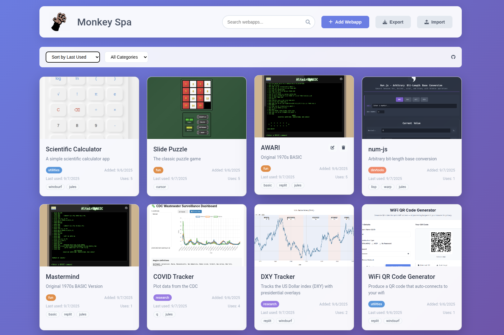

# Monkey Spa - Webapp Manager

A modern, responsive web application for managing your collection of single-page HTML webapps. Features a beautiful grid interface with metadata tracking, search capabilities, automatic screenshot generation, and easy webapp launching.

## Features

- **Grid View Interface**: Clean, modern card-based layout showing webapp previews
- **Automatic Screenshots**: Auto-generated previews of your webapps using html2canvas
- **Manual Screenshot Upload**: Option to upload custom screenshots for better quality
- **Metadata Management**: Track name, description, category, tags, usage statistics, and dates
- **Search & Filter**: Find webapps by name, description, or tags with category filtering
- **CRUD Operations**: Add, edit, and delete webapps with intuitive modals
- **Import/Export**: Backup and share webapp collections in JSON or XML format
- **Usage Tracking**: Monitor when webapps were last used and usage frequency
- **Local Storage**: All data persisted locally in your browser with no reliance on the original HTML file
- **Responsive Design**: Works perfectly on desktop, tablet, and mobile devices
- **Modern UI**: Beautiful gradients, smooth animations, and professional styling

## Getting Started

1. Open `monkey-spa.html` in your web browser
2. Click "Add Webapp" to add your first single-page HTML application. Samples included.
3. Fill in the details and upload your HTML file
4. Your webapp will appear in the grid with a preview card
5. Click on any webapp card to launch it in a new window

## Usage

### Adding Webapps
- Click the "Add Webapp" button
- Enter a name and description
- Select a category (Productivity, Games, Utilities, Entertainment, Other)
- Add comma-separated tags for better organization
- Upload your HTML file
- Optionally upload a custom screenshot (otherwise one will be auto-generated)
- Click "Save Webapp"

### Managing Webapps
- **Launch**: Click anywhere on a webapp card to open it
- **Edit**: Hover over a card and click the edit icon
- **Delete**: Hover over a card and click the delete icon

### Search & Organization
- Use the search bar to find webapps by name, description, or tags
- Filter by category using the dropdown
- Sort by date added, name, or last used

### Import & Export
- **Export**: Click "Export" to download your webapp collection
  - Choose JSON or XML format
  - Includes all webapp data, screenshots, and metadata
  - Automatic filename generation with timestamps
- **Import**: Click "Import" to restore or merge webapp collections
  - Support for both JSON and XML files
  - Choose "Merge" to add new webapps or "Replace" to overwrite all
  - Duplicate prevention by webapp ID

Note that since all apps are serialized into the exported file, this
makes it easy to transfer your entire app collection to other systems
with a single file.

## Sample Webapps

The `samples/` directory contains three example webapps to demonstrate the system:

1. **Calculator** (`calculator.html`) - A functional calculator with keyboard support
2. **Todo App** (`todo-app.html`) - A task management application with local storage
3. **Color Picker** (`color-picker.html`) - A color selection tool with multiple format outputs

You can add these sample webapps to test the manager functionality.

## Technical Details

### Data Storage
- All webapp metadata is stored in browser localStorage
- HTML file contents are stored as text within the webapp data
- No server required - everything runs client-side

### Browser Compatibility
- Modern browsers with ES6+ support
- localStorage support required
- File API support for HTML file uploads

## Customization

The system is designed to be easily customizable:

- **Styling**: Modify `styles.css` to change colors, layouts, or animations
- **Categories**: Edit the category options in both HTML and JavaScript files
- **Metadata**: Add new fields by updating the webapp data structure
- **Features**: Extend functionality by modifying `script.js`

## Security Notes

- All webapps run in new browser windows/tabs
- No server-side processing - everything is client-side
- HTML content is stored as-is without sanitization
- Only use trusted HTML files from known sources

## License

This project is open source and available under the MIT License.
